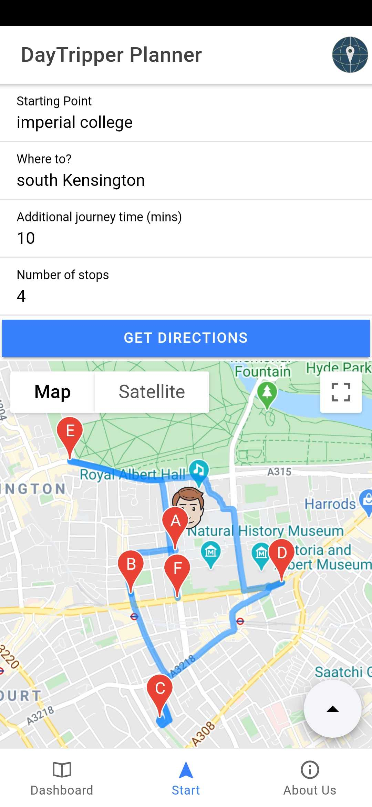

# DayTripper

## The App

DayTripper is a cross-platform app for multiple-stop route optimisation.
This is the app we created at IC Hack 2020, the UK's biggest annual student hackathon.

Let's say you want to get from point A to point B in New York and to visit 3 museums along the way. Based on the extra amount
of time you have for your journey, this app finds the best museums that match your initial route and that make your total 
journey take no longer than what you initially specify.

## How it works

Here is a screenshot of the routes page:

As you can see, the user can input a start and end location, as well as the extra time they are open to spend on their
journey and the number of stops they would like to make (4 in this example). As the app currently only looks for pubs (a variety of destination types will be added in future iterations of the app), the backend searches for POI's of the given type and performs route-
optimisation algorithms to determine the best 4 that fit in with a decent route from the start point till the end point, and that make
the journey time take longer by only the given amount of time.

The app then displys the results on a convenient map for the user to follow.

The user can also quickly order an Uber from their location through our app by tapping the round button at the bottom right-hand
side of the screen.

## Run it yourself

You will need a webserver running for the backend, the ionic framework.

1. Clone the repo locally and run `npm install` from inside the directory
2. Obtain a Google Maps API that is enabled for JavaScript Maps, Geolocation and Directions and replace the text saying
    `<GOOGLE-API-KEY>` in [index.html](./a2CrawlApp/src/index.html) with your API key.
2. Run the backend (`app.py`) on your server
3. Run the frontend through the `ionic` framwork by running `ionic serve` from inside the `a2CrawlApp` folder.
4. The CLI will display which port your app is running on (usually 8100). Open `http://localhost:8100` in your browser
    and you're good to go!